# 2024_hai_summer2

### Environment
- **python: 3.9.19**
- torch: 2.3.1
- torchvision: 0.18.1
- numpy: 2.0.1
- matplotlib: 3.9.1
- tqdm: 4.66.4

---

### Results Preview

- gif

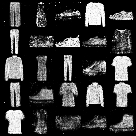

---

### Result Details

- epoch = 1

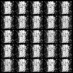

- epoch = 2

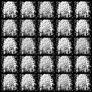

- epoch = 3

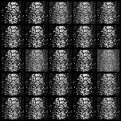

- epoch = 4

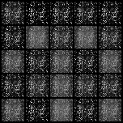

- epoch = 5

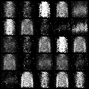

- epoch = 6

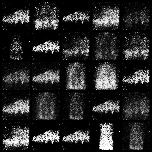

- epoch = 10

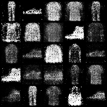

- epoch = 20

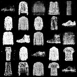

- epoch = 30

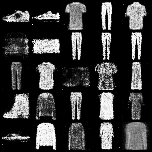

- epoch = 50

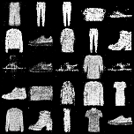
